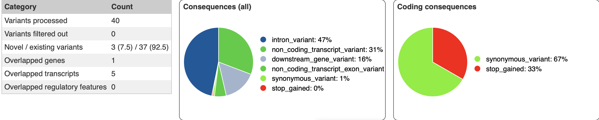

# Task 1: Variant Calling

First, we need to index the reference genome, and align the reads to reference genome:

```bash
bwa index data/chr7.fa
bwa mem data/chr7.fa data/R1.fastq data/R2.fastq > aligned.sam
```

Then, we convert SAM to BAM, sort and index the BAM for further processing:

```bash
samtools view -bS aligned.sam > aligned.bam
samtools sort aligned.bam -o sorted.bam
samtools index sorted.bam
```

Then, we perform the variant calling and convert BFC to VCF to work with the file with VEP:

```bash
bcftools mpileup -Ou -f data/chr7.fa sorted.bam | bcftools call -mv -Ob -o variants.bcf
bcftools view -Ov -o variants.vcf variants.bcf
```

Finally, we annotate the variants using VEP. We can see the summary of the  results in the following image [variants.png](variants.png).



From the results of the annotation we can see that there is 1 pathogenic
variant of the single-nucleotide variant in the location `7:2915243-2915243`.
This then might be likely causative variant.
