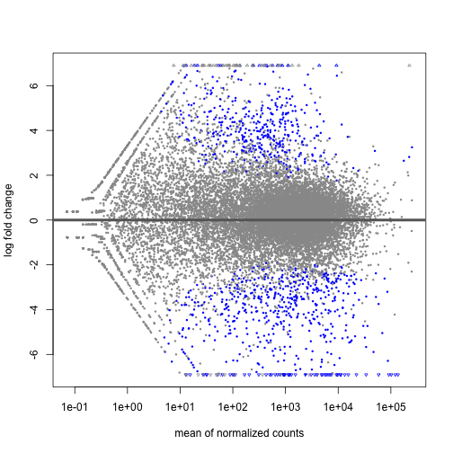
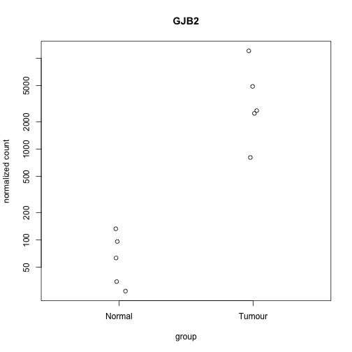
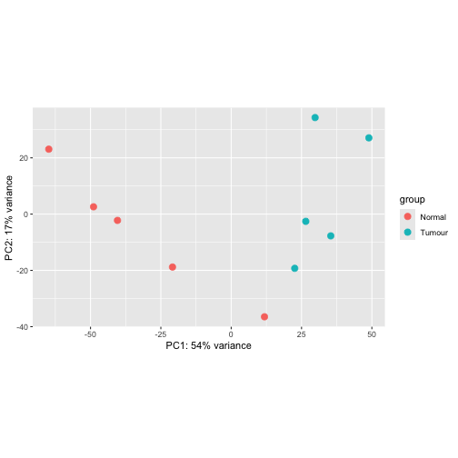
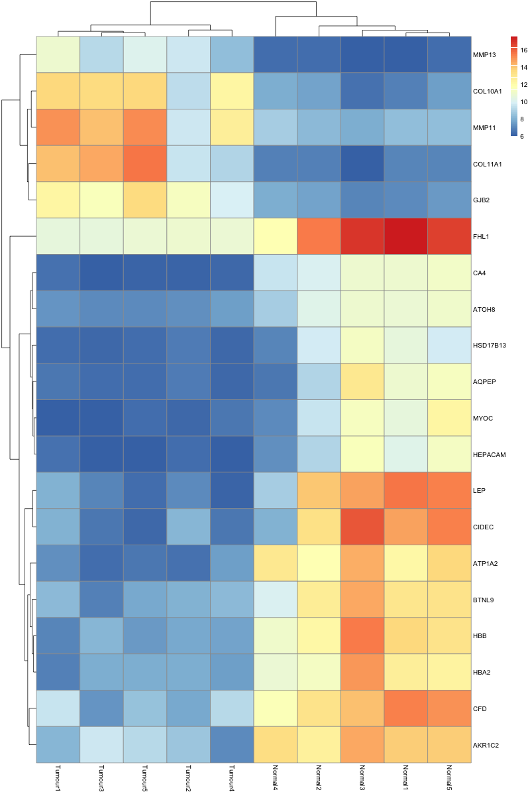

```r
# Run a differential expression analysis (Tumour vs. Normal) using a log-fold change threshold of 1
# Tutorial: http://bioconductor.org/packages/devel/bioc/vignettes/DESeq2/inst/doc/DESeq2.html#differential-expression-analysis
dds <- DESeq(dds)
res <- results(dds, contrast=c("condition","Tumour","Normal"), lfcThreshold = 1)
res
```

```
## log2 fold change (MLE): condition Tumour vs Normal 
## Wald test p-value: condition Tumour vs Normal 
## DataFrame with 19742 rows and 6 columns
##                baseMean log2FoldChange     lfcSE       stat    pvalue      padj
##               <numeric>      <numeric> <numeric>  <numeric> <numeric> <numeric>
## A1BG           193.7520      1.1376877  0.454636  2.5024147  0.381002         1
## A2M          97293.2480      0.0693866  0.716585  0.0968295        NA        NA
## NAT1          3903.5757      2.4204369  1.240204  1.9516439        NA        NA
## NAT2            46.8142     -1.7236255  1.506860 -1.1438527        NA        NA
## SERPINA3     35791.1551      1.6251959  0.918579  1.7692505  0.250191         1
## ...                 ...            ...       ...        ...       ...       ...
## NHEG1          0.142834     -0.2004658  3.160747 -0.0634236  0.951895        NA
## LOC100302401  66.817814      0.7639635  0.717902  1.0641618  0.635845         1
## LOC100302640  23.594752     -0.0784762  0.617848 -0.1270154  0.972531         1
## NCRNA00182   123.119789     -0.8961601  0.394506 -2.2716011  0.603808         1
## LOC100303728  68.052765     -0.5059157  0.448299 -1.1285225  0.865189         1
```


```r
# Generate an MA-plot
# Tutorial: http://bioconductor.org/packages/devel/bioc/vignettes/DESeq2/inst/doc/DESeq2.html#exploring-and-exporting-results
plotMA(res)
```




```r
# Plot the normalized counts for the GJB2 gene
# Tutorial: http://bioconductor.org/packages/devel/bioc/vignettes/DESeq2/inst/doc/DESeq2.html#plot-counts
plotCounts(dds, gene="GJB2", intgroup="condition", normalized = TRUE)
```




```r
# Generate a PCA plot of the samples using the transformed count data
# Tutorial: http://bioconductor.org/packages/devel/bioc/vignettes/DESeq2/inst/doc/DESeq2.html#extracting-transformed-values
# Tutorial: http://bioconductor.org/packages/devel/bioc/vignettes/DESeq2/inst/doc/DESeq2.html#principal-component-plot-of-the-samples
vsd <- vst(dds, blind=FALSE)
plotPCA(vsd, intgroup="condition")
```

```
## using ntop=500 top features by variance
```




```r
# Visualize the differential gene expression results as a heatmap
# Take the top 20 genes according to the adjusted p-value
# Tutorial: http://bioconductor.org/packages/devel/bioc/vignettes/DESeq2/inst/doc/DESeq2.html#heatmap-of-the-count-matrix
top_20_genes <- head(order(res$padj), 20)
pheatmap(assay(vsd)[top_20_genes,])
```




```r
# Export the significant results (padj < 0.01) to a CSV file
# Tutorial: http://bioconductor.org/packages/devel/bioc/vignettes/DESeq2/inst/doc/DESeq2.html#exporting-results-to-csv-files
resSig <- subset(res, padj < 0.01)

write.csv(as.data.frame(resSig), 
          file="significant_results.csv")
```


